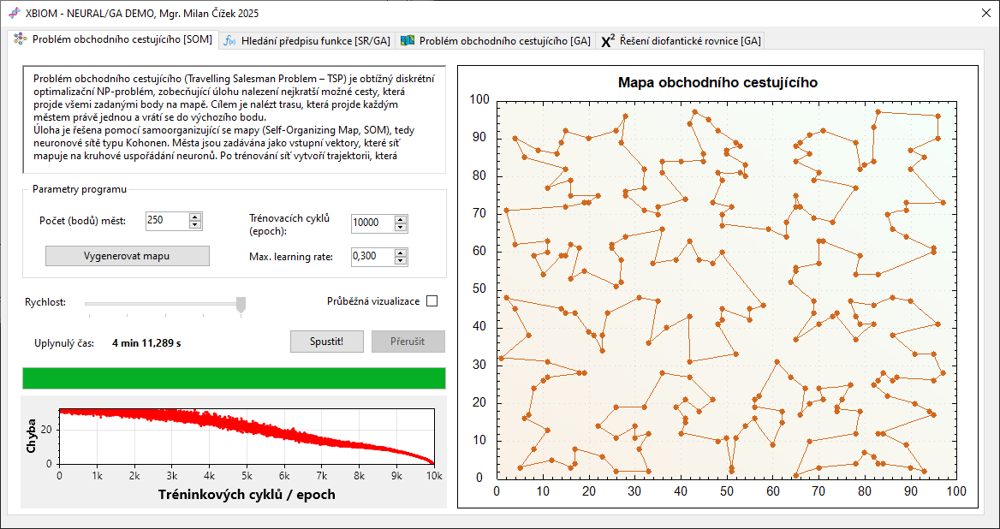
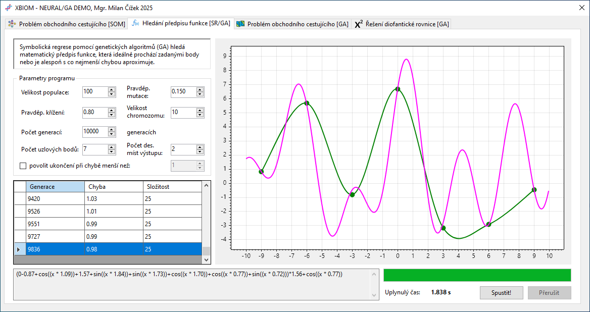
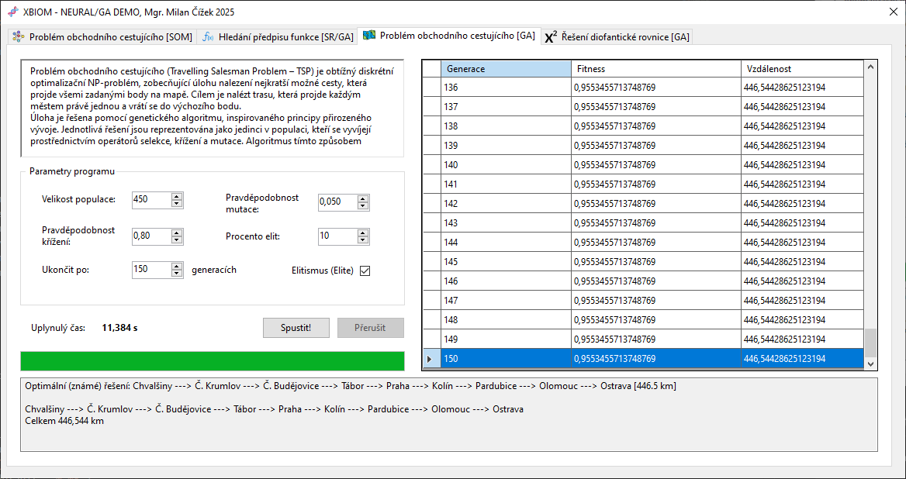
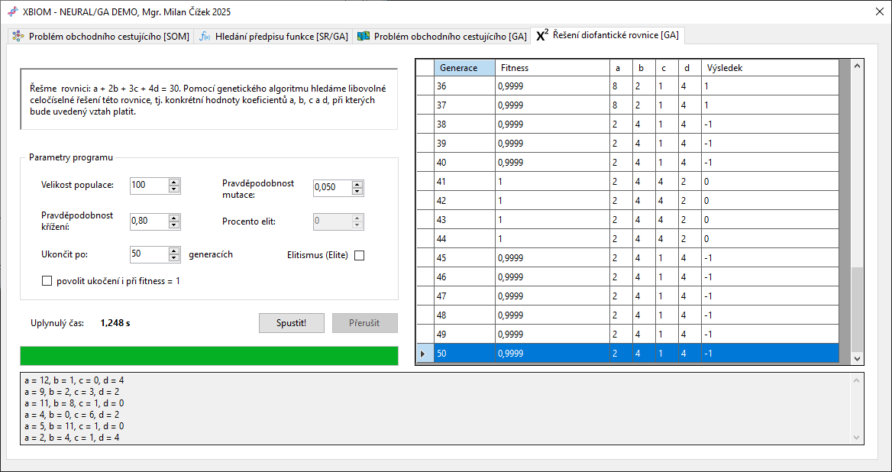

# 🧬 Biology-Inspired Optimization Methods

> Demonstration application for biology-inspired optimization methods and evolutionary algorithms.

# 🎯 Overview

This project is an educational desktop application demonstrating several optimization and evolutionary computation tasks in one shared interface.

The application is organized into separate tabs:

* Travelling Salesman Problem solved by a Self-Organizing Map
* Symbolic Regression solved by a Genetic Algorithm
* Travelling Salesman Problem solved by a Genetic Algorithm
* Diophantine Equation Solver solved by a Genetic Algorithm

Quick module comparison:

| Module | Method | Main comparable metric |
| --- | --- | --- |
| Travelling Salesman Problem – SOM | Kohonen Self-Organizing Map | route distance |
| Symbolic Regression | custom Genetic Algorithm | error + complexity score |
| Travelling Salesman Problem – GA | GAF-based Genetic Algorithm | route distance |
| Diophantine Equation Solver | GAF-based Genetic Algorithm | fitness / equation result |

The goal of the project is not to provide a production optimization framework. It is intended as a readable study project where individual algorithms can be run, interrupted, visualized, compared, and exported to CSV.

# 🧪 Application Modules

## 🧭 Travelling Salesman Problem – Self-Organizing Map

This module generates a random set of cities on a 2D grid and trains a one-dimensional circular Kohonen map over those points.

SOM training notes:

* the network learns without labeled target values
* for each city, the closest output neuron is selected as the Best Matching Unit
* the Best Matching Unit and its topological neighbors are moved toward the current city
* in this project, each output neuron's weight vector represents its current `[x, y]` position in the map
* a 1D circular output layer is used because TSP requires an ordered closed route
* the learning rate decreases linearly from the configured initial value to the fixed final value `0.1`
* a higher learning rate can adapt faster but may be unstable, while a lower value is smoother but slower

Implementation details:

* cities are generated in a 2D coordinate space from 1 to 99
* the output SOM layer is circular
* the number of output neurons is set to twice the number of cities
* the initial learning rate is configurable
* the final learning rate is fixed to `0.1`
* the route is derived by sorting cities according to their nearest output neuron
* the route distance is calculated as a closed Euclidean route in the same 2D grid
* the average SOM error is calculated as the mean distance from each city to its nearest neuron

Configurable parameters:

* number of cities (default: `50`)
* number of training cycles / epochs (default: `10000`)
* initial learning rate (default: `0.3`)
* visualization speed (default: `2`)
* continuous visualization on/off (default: `on`)

Output file:

```text
salesman_som.csv
```

The CSV output contains the comparable route distance, average error, SOM parameters, elapsed time, and run status.



## 📈 Symbolic Regression

This module searches for a mathematical expression approximating a set of user-defined or randomly generated points.

Unlike the other GA examples that use the GAF library, symbolic regression is implemented with a custom genetic algorithm tailored to expression evolution.

Implementation details:

* a chromosome is a fixed-length sequence of simple operations
* each gene stores one operation and one numeric value
* supported operations include addition, subtraction, multiplication, multiplication by `x`, trigonometric functions, absolute value, and exponential function
* parent selection uses tournament selection with tournament size `3`
* elitism keeps the best `10%` of the population in each generation
* crossover combines two parent chromosomes using a single split point
* mutation randomly replaces individual genes according to the configured mutation probability
* the run can optionally stop when the target error is reached

Displayed progress:

* generation
* current best error
* complexity score of the current best expression

The table only records improvements of the best solution, so it acts as a compact history of meaningful search progress.
Double-clicking a table row restores the selected intermediate expression in the plot, making it easy to review how the solution evolved during the run.

### 📐 Error and Complexity Scoring

The main error value is the sum of absolute deviations between the generated expression and the expected `y` values.

The CSV also stores the mean absolute error, which makes runs easier to compare when the number of training points changes.

Expression complexity is scored as a weighted sum of operations:

| Operation type | Score |
| --- | ---: |
| addition, subtraction, `+x`, `-x` | 1 |
| multiplication, multiplication by `x` | 2 |
| sine, cosine, absolute value | 3 |
| exponential function | 4 |

This score is intentionally simple. It is not a formal symbolic complexity metric, but it provides a useful comparable number when multiple runs produce expressions with similar error.

Configurable parameters:

* chromosome length (default: `10`)
* population size (default: `100`)
* generation limit (default: `10000`)
* crossover probability (default: `0.8`)
* mutation probability (default: `0.05`)
* number of generated points (default: `5`)
* output precision (default: `2` decimal places)
* optional target error for early stopping (default: disabled, threshold `1`)

Output file:

```text
symbolic_regression.csv
```

The CSV output stores the resulting expression, error metrics, complexity score, algorithm parameters, elapsed time, and run status.



## 🗺️ Travelling Salesman Problem – Genetic Algorithm

This module solves a fixed travelling salesman problem over a predefined set of Czech cities.

The cities are defined directly in code by GPS coordinates. Coordinates are stored in decimal degrees in the constructor order `City(name, latitude, longitude)`.

Users can change the input dataset by editing the `CreateCities()` method in `Algorithms/Tsp/TspGaProblem.cs`.

Example:

```csharp
private static List<City> CreateCities()
{
    // GPS coordinates are stored as decimal degrees: latitude, longitude.
    return new List<City>
    {
        new("Olomouc", 49.593778, 17.250879),
        new("Chvalšiny", 48.854019, 14.211139),
        new("Č. Budějovice", 48.975658, 14.480255),
        new("Tábor", 49.412989, 14.677466),
        new("Č. Krumlov", 48.812735, 14.317466),
        new("Pardubice", 50.034309, 15.781199),
        new("Praha", 50.075538, 14.437800),
        new("Kolín", 50.027329, 15.202728),
        new("Ostrava", 49.820923, 18.262524),
    };
}
```

Implementation details:

* each chromosome represents one city ordering
* the initial population is created by shuffling all cities
* route distance is calculated using geographic coordinates
* the distance metric is Haversine distance in kilometers
* the route is evaluated as an open route
* fitness is derived from route length because the GAF library maximizes fitness values
* the application displays generation, fitness, and route distance during the run

The module also shows a known reference route in the result text box:

```text
Chvalšiny -> Český Krumlov -> České Budějovice -> Tábor -> Praha -> Kolín -> Pardubice -> Olomouc -> Ostrava
```

Configurable parameters:

* population size (default: `250`)
* generation limit (default: `50`)
* crossover probability (default: `0.8`)
* mutation probability (default: `0.05`)
* elitism percentage (default: enabled, `10%`)

Output file:

```text
salesman_ga.csv
```

The CSV output stores the comparable route distance, fitness, GA parameters, elapsed time, and run status.



## 🧮 Diophantine Equation Solver

This module searches for integer values satisfying the equation:

```text
a + 2b + 3c + 4d = 30
```

Implementation details:

* each chromosome contains four integer genes: `a`, `b`, `c`, and `d`
* initial gene values are generated as integers from `0` to `99`
* the equation is internally evaluated as `a + 2b + 3c + 4d - 30`
* a correct solution therefore has result `0`
* fitness is derived from the absolute distance from zero
* the run can stop automatically when fitness reaches `1`

Displayed progress:

* generation
* fitness
* values of `a`, `b`, `c`, and `d`
* current equation result

Configurable parameters:

* population size (default: `100`)
* generation limit (default: `50`)
* crossover probability (default: `0.8`)
* mutation probability (default: `0.05`)
* optional elitism (default: disabled)
* optional early stop on fitness `1` (default: enabled)

Output file:

```text
diophantine.csv
```

The CSV output stores the resulting values, equation result, fitness, GA parameters, elapsed time, and run status.



# 📊 CSV Outputs

All result files are written to the application working directory.

Each output row follows the same general structure:

```text
result values, task metrics, active parameters, elapsed time, run status
```

Run status values:

| Value | Meaning |
| --- | --- |
| `OK` | the computation finished normally |
| `INT` | the computation was interrupted by the user |

If an existing CSV file has an outdated header, it is automatically renamed with an `_old_yyyyMMdd_HHmmss` suffix and a new file with the current structure is created.

# 🗂️ Project Structure

```text
/
├── Algorithms/
│   ├── Diophantine/              # Diophantine equation model and fitness
│   ├── Genetic/                  # Shared GAF helper layer
│   ├── SymbolicRegression/       # Custom symbolic regression GA
│   └── Tsp/                      # TSP city model and GA problem definition
│
├── Helpers/
│   └── ResultSaver.cs            # Shared CSV export logic and result DTOs
│
├── docs/                         # Demo animations for application modules
│   ├── tsp-som-demo.png
│   ├── symbolic-regression-demo.png
│   ├── tsp-ga-demo.png
│   └── diophantine-demo.png
│
├── Properties/                   # Application resources
│
├── UI/
│   ├── Tasks/                    # UI event logic split by application tab
│   ├── res/                      # Embedded icons and visual resources
│   ├── frmMain.cs
│   ├── frmMain.Designer.cs
│   └── Program.cs
│
├── XBIOM.Tests/                  # xUnit tests for calculation logic
│   ├── CityTests.cs
│   ├── DiophantineProblemTests.cs
│   ├── SymbolicRegressionChromosomeTests.cs
│   ├── SymbolicRegressionEvaluatorTests.cs
│   └── TspGaProblemTests.cs
│
├── XBIOM.csproj
└── XBIOM.sln
```

# 🔧 Requirements

* Windows
* .NET 8 SDK
* Visual Studio 2022 or newer with Windows Forms support

Main NuGet packages:

* `CsvHelper`
* `GAF`
* `NeuronDotNet.Core45`
* `ScottPlot.WinForms`
* `ZedGraph`

`NeuronDotNet.Core45` is an older .NET Framework package. The project currently keeps it because the SOM implementation depends on it.

The test project uses:

* `xunit`
* `Microsoft.NET.Test.Sdk`
* `xunit.runner.visualstudio`
* `coverlet.collector`

# 🚀 Running the Application

From the repository root:

```powershell
dotnet restore
dotnet build XBIOM.sln
dotnet run --project XBIOM.csproj
```

The application can also be opened and run directly from Visual Studio using `XBIOM.sln`.

# 🧪 Testing

Run all tests:

```powershell
dotnet test XBIOM.sln
```

The test suite currently covers:

* symbolic regression expression evaluation
* symbolic regression chromosome fitness, cloning, formatting, and complexity scoring
* Diophantine equation evaluation and fitness calculation
* city distance calculation using GPS coordinates
* TSP GA route distance, fitness, and route formatting

# ⚠️ Current Limitations

Known limitations:

* the SOM module depends on the legacy `NeuronDotNet.Core45` package
* the TSP GA and TSP SOM modules use different distance metrics and route assumptions
* random seeds are not currently exposed in the UI, so repeated runs are not exactly reproducible
* the symbolic regression complexity score is heuristic and intended for comparison, not formal mathematical complexity analysis
* the UI and comments are primarily Czech because the application was built as a study project

# Status

Current status:

- ✅ four educational modules are implemented
- ✅ CSV export is implemented for all modules
- ✅ elapsed time and run status are stored in CSV outputs
- ✅ long-running GA tasks can be interrupted
- ✅ symbolic regression uses a custom GA implementation with error and complexity scoring
- ✅ xUnit test project covers core calculation logic

# License

Educational project intended for study and demonstration purposes.
